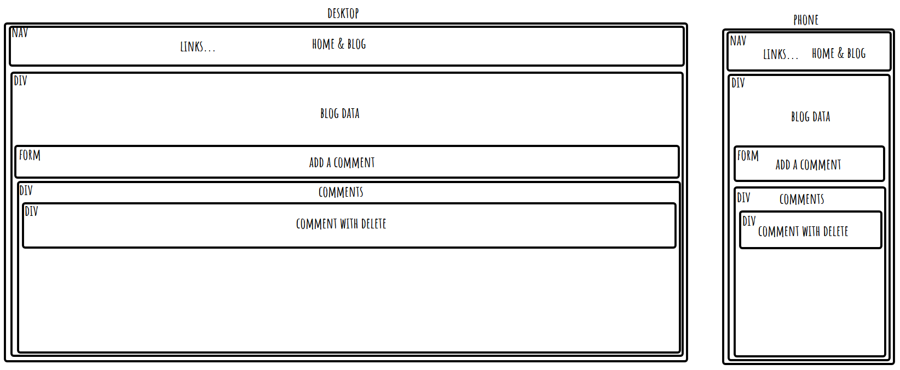
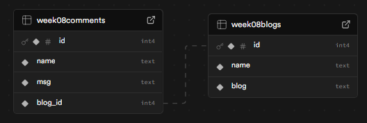

# week 8 assingment

## Reflection

- basic requirements
  
  

  - Display all posts with an option to sort them --done
  - Create a SQL schema with a foreign key --done
  - add a delete button on comments --done
  - Create a form which saves comments --done
  - Allow users to comment --done
  - Add a redirect --done

## References

- i use okso.app to help make a layout
- i use tailwindcss.504b.cc to help with styleing

next.js drive me up the wall with "use client" and "use server" as trying to get thing to work how i want them to was hard
i dont want to try stretch goals this time as i think i may break it
